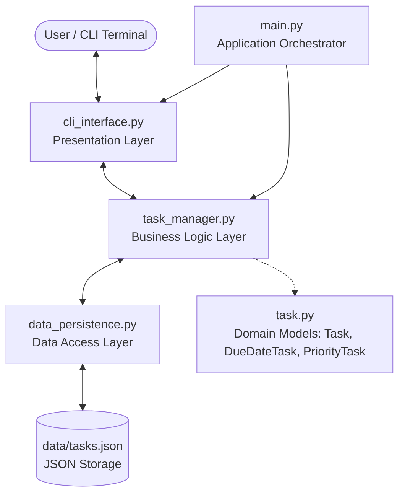
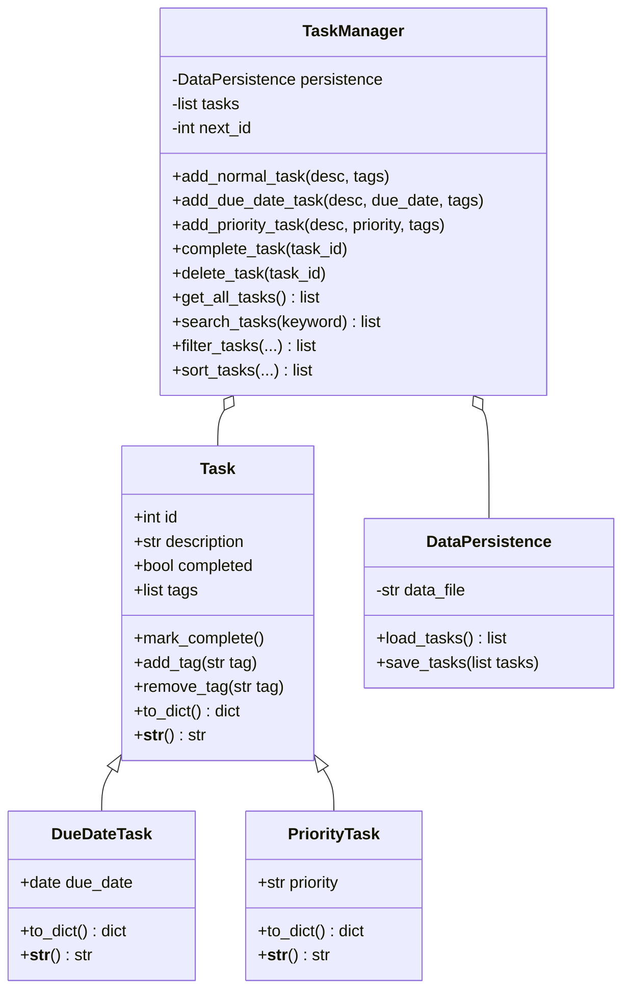

# Project Plan: Enhanced Task Manager CLI

## 1. Introduction
This document outlines the software engineering plan and design specifications for developing an enhanced Command-Line Interface (CLI) Task Manager application. Building upon basic programming concepts, this version focuses on architectural design, modularity, advanced task management features, and clear separation of concerns (SoC) to facilitate long-term maintainability and extensibility.

---

## 2. Requirements Specification

### 2.1 Functional Requirements (What the system will do)
* **Core Task CRUD:**
  * **Create Tasks:** Support creation of general tasks with description, completion status (default: pending), and custom tags.
  * **Specialized Task Types:**
    * `DueDateTask`: Inherits from `Task`, includes a deadline (`YYYY-MM-DD`).
    * `PriorityTask`: Inherits from `Task`, includes a priority level (`High`, `Medium`, `Low`).
  * **Read/List Tasks:** Display all tasks formatted with type-specific attributes and associated tags.
  * **Update Task Status:** Mark tasks as completed by ID.
  * **Delete Tasks:** Remove tasks by ID with ID validation and feedback.
* **Advanced Task Retrieval (Assignments for Students):**
  * **Search:** Search across task descriptions and tags using case-insensitive keyword matching.
  * **Filter:** Filter tasks by completion status (`completed`/`pending`), due date range (e.g., tasks due before a specified date), priority level, or specific tags.
  * **Sort:** Sort tasks by ID, due date, or priority level (with ascending/descending options).
* **Data Persistence:**
  * Save all task states automatically to `data/tasks.json` upon creation, status modification, or deletion.
  * Load and reconstruct polymorphic objects (`Task`, `DueDateTask`, `PriorityTask`) from `data/tasks.json` on application startup.

### 2.2 Non-Functional Requirements (System Qualities)
* **Usability:** Intuitive CLI menu with clear error messaging, prompts, and input validation.
* **Reliability & Robustness:** Graceful handling of corrupted data, invalid dates, and non-numeric inputs without application crashes.
* **Modularity & Maintainability:** Strict separation of presentation, business logic, data models, and persistence layers.
* **Extensibility:** Open-Closed Principle (OCP); easy to introduce new task types (e.g., `RecurringTask`) or new storage backends (e.g., SQLite) without rewriting existing layers.
* **Performance:** Sub-second execution for typical collections (hundreds of tasks).

---

## 3. High-Level Architecture & Design

### 3.1 Architectural Diagram


### 3.2 Directory Structure
```text
enhanced-task-manager/
├── src/
│   ├── __init__.py          # Marks src as a Python package
│   ├── task.py              # Domain Models: Task, DueDateTask, PriorityTask
│   ├── data_persistence.py  # Data Layer: Centralized JSON file I/O
│   ├── task_manager.py      # Business Logic: Collection management & algorithms
│   └── cli_interface.py     # UI Layer: Terminal menus, prompts & validation
├── data/
│   └── tasks.json           # Persistent task database (JSON format)
├── main.py                  # Entry point / Orchestrator
├── .gitignore               # Git ignore configuration
├── PLAN.md                  # Software design specification (This document)
└── README.md                # Project guide and student assignment instructions
```

### 3.3 Module Responsibilities
1. **`src/task.py` (Domain Models):**
   * Encapsulates task state: `id`, `description`, `completed`, `tags`.
   * Specializes behavior in subclasses: `due_date` in `DueDateTask`, `priority` in `PriorityTask`.
   * Implements serialization (`to_dict`) and formatted string rendering (`__str__`, `__repr__`).
2. **`src/data_persistence.py` (Persistence Layer):**
   * Centralizes all disk I/O operations (`data/tasks.json`).
   * Deserializes raw JSON dictionaries into concrete domain model instances based on `_type`.
   * Handles I/O exceptions (`FileNotFoundError`, `JSONDecodeError`).
3. **`src/task_manager.py` (Business Logic Layer):**
   * Manages in-memory list of tasks and handles task lifecycle (ID generation, CRUD).
   * Coordinates with `DataPersistence` for saving changes.
   * Houses core algorithms: `search_tasks`, `filter_tasks`, `sort_tasks`.
4. **`src/cli_interface.py` (Presentation Layer):**
   * Renders interactive text menus and processes user commands.
   * Validates user inputs (date strings, integer IDs, priority values).
   * Decoupled from internal data structures and storage specifics.
5. **`main.py` (Application Orchestrator):**
   * Bootstraps dependencies and starts the main CLI event loop.

---

## 4. Class Diagram & Inheritance


---

## 5. Potential Challenges & Engineering Considerations
1. **Sorting Heterogeneous Objects:**
   * Sorting tasks by `due_date` when regular `Task` instances have no `due_date`.
   * Solution: Provide a fallback sorting key (e.g., `datetime.date.max`) so tasks without a deadline sort neatly at the end.
2. **Date Format Validation:**
   * Ensuring robust parsing for user dates while supporting standard ISO format (`YYYY-MM-DD`).
3. **Data Deserialization Safety:**
   * Ensuring unknown or corrupted `_type` entries in `tasks.json` do not crash the entire application.

---

## 6. Future Enhancements
* Reminders and notifications for overdue or upcoming tasks.
* Migration of `data_persistence.py` from JSON flat files to SQLite / SQLAlchemy.
* Graphical User Interface (GUI) via PyQt or Web UI using FastAPI/React.
* Multi-user support with authentication.
