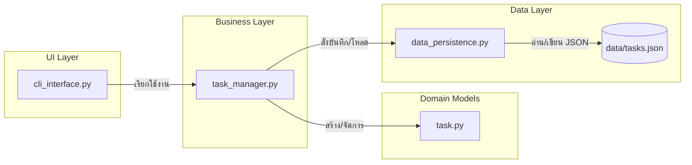

# Week 11: Project Planning & Design — Enhanced Task Manager CLI
> **เอกสารคู่มือโปรเจกต์และข้อกำหนดการส่งงาน สำหรับนักศึกษาชั้นปีที่ 2**  
> รายวิชาการออกแบบและพัฒนาซอฟต์แวร์ (Software Engineering / Object-Oriented Programming & Design)

---

## 📖 1. ภาพรวมและวัตถุประสงค์ของโปรเจกต์ (Overview & Objectives)

ยินดีต้อนรับนักศึกษาทุกคนเข้าสู่การเรียนรู้ใน **สัปดาห์ที่ 11: Project Planning & Design**

ในการพัฒนาซอฟต์แวร์จริง การกระโดดลงไปเขียนโค้ดทันทีโดยไม่มีการวางแผน มักนำไปสู่ปัญหา **"Spaghetti Code"** (โค้ดยุ่งเหยิง ผูกติดกันแน่น แก้จุดหนึ่งพังอีกจุดหนึ่ง) และ **"Feature Creep"** (ขอบเขตงานบานปลาย ควบคุมทิศทางไม่ได้)

โปรเจกต์นี้ได้รับการออกแบบเพื่อเปลี่ยนผ่านแนวคิดของนักศึกษาจากการ **"เขียนโค้ดตามคำสั่ง (Tactical Coding)"** ไปสู่ **"การคิดเชิงสถาปัตยกรรม (Architectural Thinking)"** โดยเราจะสร้างระบบจัดการงานผ่านบรรทัดคำสั่ง (**Enhanced Task Manager CLI**) ที่รองรับงานหลากหลายรูปแบบ (Normal Task, Due Date Task, Priority Task) พร้อมระบบจัดเก็บข้อมูล (Data Persistence) และการจัดการขั้นสูง (Search, Filter, Sort, Tags)

### 🎯 วัตถุประสงค์การเรียนรู้ (Learning Outcomes)
1. **เข้าใจคุณค่าของการวางแผนก่อนเริ่มเขียนโค้ด (Design Before Code):** รู้วิธีกำหนด Functional และ Non-Functional Requirements
2. **การแยกหน้าที่ของระบบ (Separation of Concerns - SoC):** แยกส่วนติดต่อผู้ใช้ (UI), ตรรกะทางธุรกิจ (Business Logic), และชั้นจัดเก็บข้อมูล (Persistence) ออกจากกันอย่างเด็ดขาด
3. **การออกแบบเชิงวัตถุระดับสูง (OOP: Inheritance & Polymorphism):** ออกแบบคลาสแม่-ลูก (`Task`, `DueDateTask`, `PriorityTask`) และใช้งาน Polymorphism ในการจัดการข้อมูลและแปลงเป็น JSON
4. **ความสามารถในการขยายระบบ (Extensibility):** การออกแบบโครงสร้างที่เอื้อต่อการเพิ่มฟีเจอร์ใหม่ในอนาคต โดยไม่ต้องรื้อโค้ดเดิม

---

## 🏗️ 2. สถาปัตยกรรมของโปรเจกต์ (Software Architecture)

โปรเจกต์นี้ใช้โครงสร้างแบบหลายชั้น (Multi-layer Modular Architecture) โดยแต่ละโมดูลมีบทบาทหน้าที่ชัดเจน:



### โครงสร้างโฟลเดอร์และไฟล์ (Directory Structure)
```text
enhanced-task-manager/
├── src/
│   ├── __init__.py          # กำหนดให้โฟลเดอร์ src เป็น Python Package
│   ├── task.py              # [Models] โครงสร้างข้อมูล Task, DueDateTask, PriorityTask
│   ├── data_persistence.py  # [Data Layer] จัดการอ่าน/เขียนไฟล์ JSON
│   ├── task_manager.py      # [Business Logic] จัดการ CRUD, ค้นหา, กรอง, จัดเรียง
│   └── cli_interface.py     # [Presentation] แสดงผลเมนู CLI, รับและตรวจสอบข้อมูลผู้ใช้
├── data/
│   └── tasks.json           # ไฟล์ฐานข้อมูลจำลอง (JSON Storage)
├── main.py                  # [Orchestrator] ไฟล์หลักสำหรับเริ่มการทำงานของระบบ
├── .gitignore               # กำหนดไฟล์ที่ไม่ต้องการให้ Git ติดตาม
├── PLAN.md                  # เอกสารแผนงานและการออกแบบสถาปัตยกรรมฉบับสมบูรณ์
└── README.md                # เอกสารคู่มือโปรเจกต์ (ไฟล์นี้)
```

---

## 🚀 3. วิธีการติดตั้งและเริ่มใช้งาน (Getting Started)

### ความต้องการของระบบ (Prerequisites)
- **Python:** เวอร์ชัน 3.8 ขึ้นไป (แนะนำ Python 3.10+)
- **Git:** ติดตั้งแล้วในเครื่อง
- ไม่จำเป็นต้องติดตั้งไลบรารีภายนอกเพิ่มเติม (ใช้ Standard Libraries ของ Python: `json`, `datetime`, `os`, `sys`)

### ขั้นตอนการรันโปรแกรม
1. โคลนคลังโค้ดนี้ลงในเครื่องของคุณ:
   ```bash
   git clone <URL ของ GitHub Repository>
   cd <ชื่อโฟลเดอร์โปรเจกต์>
   ```

2. ทดสอบเริ่มรันโปรแกรม:
   ```bash
   python main.py
   ```

3. คุณจะพบกับหน้าต่างเมนูหลักของโปรแกรม:
   ```text
   =============================================
        Enhanced Task Manager (Week 11)
   =============================================
   1. เพิ่มงานทั่วไป (Add Normal Task)
   2. เพิ่มงานที่มีวันครบกำหนด (Add Due Date Task)
   3. เพิ่มงานที่มีระดับความสำคัญ (Add Priority Task)
   4. แสดงรายการงานทั้งหมด (List All Tasks)
   5. เปลี่ยนสถานะงานเป็นเสร็จสิ้น (Complete Task)
   6. ลบงาน (Delete Task)
   7. ค้นหางาน (Search Tasks - Assignment)
   8. กรองงาน (Filter Tasks - Assignment)
   9. เรียงลำดับงาน (Sort Tasks - Assignment)
   0. ออกจากโปรแกรม (Exit)
   ---------------------------------------------
   เลือกเมนู (0-9):
   ```

---

## 📝 4. ภารกิจที่นักศึกษาต้องทำในโปรเจกต์นี้ (Student Tasks)

ในโค้ดโครงสร้างเริ่มต้น (Skeleton Code) ส่วนการทำงานพื้นฐาน (เมนู 1–6) และระบบบันทึกไฟล์ JSON ได้รับการวางโครงสร้างไว้พร้อมใช้งานแล้ว 

ภารกิจของนักศึกษาคือ **การเติมเต็มระบบให้สมบูรณ์ (Complete Implementation)** ตามข้อกำหนดดังต่อไปนี้:

### ภารกิจที่ 1: ศึกษาเอกสารการออกแบบ `PLAN.md`
- อ่านและทำความเข้าใจความรับผิดชอบของแต่ละคลาสใน [PLAN.md](file:///PLAN.md)
- ทำความเข้าใจหลักการทำงานของฟังก์ชัน `to_dict()`, `load_tasks()` และ `save_tasks()`

### ภารกิจที่ 2: พัฒนาระบบค้นหางาน (`search_tasks`) ใน `src/task_manager.py`
- ฟังก์ชันต้องรับคำสำคัญ `keyword` (String)
- ทำการค้นหาคำสำคัญในรายละเอียดงาน (`description`) **หรือ** ในรายการป้ายกำกับ (`tags`)
- การค้นหาต้องเป็นแบบ **Case-Insensitive** (ไม่สนใจตัวพิมพ์เล็กหรือตัวพิมพ์ใหญ่ เช่น ค้นหา "python" หรือ "PYTHON" ต้องเจอผลลัพธ์เดียวกัน)
- ส่งคืนลิสต์ของรายการงานที่ตรงตามเงื่อนไข

### ภารกิจที่ 3: พัฒนาระบบกรองงาน (`filter_tasks`) ใน `src/task_manager.py`
- รองรับการกรองตามเงื่อนไข (สามารถเลือกกรองข้อใดข้อหนึ่ง หรือกรองพร้อมกันหลายข้อได้):
  - `status`: กรองเฉพาะงานที่เสร็จแล้ว (`True`) หรือยังไม่เสร็จ (`False`)
  - `due_date_before`: กรองเฉพาะงานประเภท `DueDateTask` ที่มีกำหนดส่งภายในหรือก่อนวันที่ระบุ (`<= due_date`)
  - `priority`: กรองเฉพาะงานประเภท `PriorityTask` ที่ตรงกับระดับความสำคัญ (`High`, `Medium`, หรือ `Low`)
  - `tags`: กรองเฉพาะงานที่มี Tag ตรงกับที่ระบุ
- ส่งคืนลิสต์ของงานที่ผ่านเงื่อนไขการกรอง

### ภารกิจที่ 4: พัฒนาระบบเรียงลำดับงาน (`sort_tasks`) ใน `src/task_manager.py`
- รองรับการจัดเรียงตามเกณฑ์:
  - `"id"`: เรียงตามหมายเลข ID ของงาน
  - `"due_date"`: เรียงตามวันครบกำหนด (งานประเภท `DueDateTask`) โดยงานทั่วไปที่ไม่มีวันครบกำหนดจะต้องถูกจัดไว้ลำดับท้ายสุดอย่างปลอดภัย
  - `"priority"`: เรียงตามระดับความสำคัญ (`High` มาก่อน `Medium` และ `Low`)
- รองรับพารามิเตอร์ `reverse`:
  - `False` = เรียงจากน้อยไปมาก (Ascending)
  - `True` = เรียงจากมากไปน้อย (Descending)

### ภารกิจที่ 5: ตรวจสอบและเชื่อมต่อ UI ใน `src/cli_interface.py`
- ตรวจสอบว่าเมนู 7 (ค้นหา), เมนู 8 (กรอง), และเมนู 9 (จัดเรียง) รับค่าและส่งต่อให้อ็อบเจกต์ `TaskManager` ได้อย่างถูกต้อง
- แสดงผลลัพธ์ที่ค้นพบหรือแจ้งเตือนกรณีไม่พบข้อมูลอย่างสุภาพและชัดเจน

### ภารกิจพิเศษ (Bonus Challenge - รับคะแนนเสริม):
- เพิ่มคำสั่งลบหรือแก้ไข Tag ของงานที่มีอยู่เดิมผ่านเมนู CLI
- เขียน Automated Unit Test ด้วยโมดูล `unittest` ใน Python เพื่อทดสอบการทำงานของ `TaskManager`

---

## 📦 5. สิ่งที่ต้องส่งและแนวทางการส่งงาน (Deliverables & Submission)

นักศึกษาจะต้องส่งผลงานผ่านช่องทางที่ผู้สอนกำหนด โดยต้องมีองค์ประกอบครบถ้วนดังนี้:

| ลำดับ | รายการสิ่งที่ต้องส่ง | รายละเอียด |
| :---: | :--- | :--- |
| **1** | **GitHub Repository Link** | ลิงก์ของ GitHub Repository ส่วนตัวหรือของกลุ่ม (ตั้งเป็น Public หรือเพิ่มอาจารย์ผู้สอนเป็น Collaborator) |
| **2** | **Source Code ฉบับสมบูรณ์** | โค้ดในโฟลเดอร์ `src/` ที่ได้รับการ Implement ฟังก์ชันค้นหา, กรอง และเรียงลำดับอย่างสมบูรณ์ ไม่มีข้อผิดพลาด (Zero Syntax Error) |
| **3** | **Git Commit History** | ประวัติการ Commit ที่สม่ำเสมอ มีข้อความ Commit ที่สื่อความหมายชัดเจนตามแนวทาง Conventional Commits (เช่น `feat: implement search_tasks logic`, `fix: handle missing due_date in sorting`) **ห้ามรวม Commit เดียวส่งในวันสุดท้าย** |
| **4** | **เอกสารรายงานการทดสอบ (Test Report)** | บันทึกภาพหน้าจอ (Screenshots) หรือ Log ผลการทดสอบการใช้งานเมนู 1–9 เพื่อยืนยันว่าโปรแกรมทำงานได้ถูกต้องครบทุกฟังก์ชัน แนบไว้ในโฟลเดอร์ `docs/` หรือในคำอธิบายของ GitHub Pull Request / Release |
| **5** | **การปรับปรุง PLAN.md (ถ้ามี)** | หากมีการเปลี่ยนแปลงสถาปัตยกรรมหรือเพิ่มคลาสใหม่ ให้ปรับปรุงเนื้อหาใน `PLAN.md` ให้สอดคล้องกัน |

---

## 📊 6. เกณฑ์การให้คะแนน (Evaluation Rubric - 100 คะแนน)

| เกณฑ์การประเมิน | สัดส่วน | รายละเอียด |
| :--- | :---: | :--- |
| **1. ฟังก์ชันการทำงาน (Functionality)** | **40%** | - ระบบ CRUD พื้นฐานทำงานได้สมบูรณ์ (10%)<br>- ระบบค้นหา (`search_tasks`) ทำงานได้ถูกต้องแม่นยำ (10%)<br>- ระบบกรอง (`filter_tasks`) รองรับทุกเงื่อนไขอย่างถูกต้อง (10%)<br>- ระบบจัดเรียง (`sort_tasks`) จัดการเงื่อนไขและคลาสต่างชนิดได้ (10%) |
| **2. สถาปัตยกรรมซอฟต์แวร์และการออกแบบเชิงวัตถุ (Architecture & OOP)** | **25%** | - ปฏิบัติตามหลัก Separation of Concerns (ไม่เขียนโค้ดปะปนข้ามชั้น) (10%)<br>- การสืบทอดคุณสมบัติ (Inheritance) และการใช้ Polymorphism ในการ Serialize/Deserialize (10%)<br>- การเขียนโค้ดเป็นโมดูลที่ขยายต่อได้ง่าย (Extensibility) (5%) |
| **3. คุณภาพโค้ดและการจัดการข้อผิดพลาด (Code Quality & Robustness)** | **15%** | - มีการตรวจจับ Exception (ไฟล์เสียหาย, รูปแบบวันที่ผิด, ID ไม่ถูกต้อง) อย่างรอบคอบ (10%)<br>- รูปแบบโค้ดสะอาด มี Docstring และตั้งชื่อตัวแปรสื่อความหมายตาม PEP 8 (5%) |
| **4. การจัดทำเอกสารและการใช้งาน Git (Documentation & Git Practice)** | **20%** | - มีประวัติ Git Commits ที่ดีและสม่ำเสมอตามหลักการทำ Version Control (10%)<br>- บันทึกผลการทดสอบครบถ้วน และเอกสาร README/PLAN ชัดเจน (10%) |

---

## 💡 7. คำแนะนำในการเขียนโค้ดและข้อควรระวัง (Tips & Best Practices)

> [!TIP]
> **การจัดเรียงข้อมูลที่มีความหลากหลาย (Heterogeneous Sorting):**  
> งานประเภท `Task` ทั่วไปจะไม่มีแอตทริบิวต์ `due_date` หากนักศึกษาสั่ง `task.due_date` โดยตรงจะเกิด `AttributeError`  
> ให้ใช้ `isinstance(task, DueDateTask)` หรือใช้ฟังก์ชัน `getattr(task, 'due_date', datetime.date.max)` เพื่อช่วยกำหนดค่างานที่ไม่มีวันกำหนดส่งให้อยู่ท้ายสุดเสมอ

> [!IMPORTANT]
> **ห้ามละเมิดหลัก Separation of Concerns:**  
> - ใน `task_manager.py` **ต้องไม่มี** คำสั่ง `print()` หรือ `input()` เป็นอันขาด (ยกเว้นข้อความ DEBUG ชั่วคราว)  
> - ใน `cli_interface.py` **ต้องไม่** เขียนโค้ดจัดการไฟล์ JSON หรือคำนวณ Business Logic โดยตรง ให้เรียกผ่านเมธอดของ `TaskManager` เสมอ

---
**ขอให้สนุกกับการออกแบบและพัฒนาซอฟต์แวร์อย่างเป็นระบบ! 🚀**
